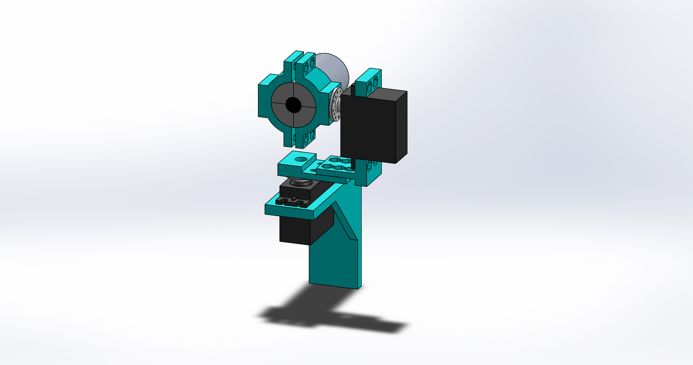

# FaceTrack
A visual servoing example using SimpleCV and an Arduino. 

## Motivation
The motivation behind this project came from the desire to implement visual servoing in the real world in an application I would actually use. While I don't do it often enough I occasionally video chat with my parents. When video chatting the camera position and viewport is static and usually I end up fiddling with it until it's roughly pointing at my face during the chat. If I moved around I would fall out of frame. I know some higher-end web cameras have facial tracking built into them but I never could justify the expense when it looked like something easy to implement. It turns out I was right, it's pretty easy to do!

## How It Works
This project has three core "parts". The Hardware consists of a DIY pan/tilt webcamera controlled by an arduino. The firmware simply listens for desired servo positions over the serial port and sends those to the attached servoss. The software is where the magic happens. Using a [Haar Cascade](http://simplecv.sourceforge.net/doc/cookbook.html) faces infront of the camera are recognized, facial offsets are calculated, and new servo positions are sent to the arduino over serial. The final result is a camera setup which follows your face! 

## Bill of Materials/Software
### Hardware
You need the following physical items

* A webcamera of some kind. Any usb web camera should work. I used a [Microsoft Lifecam Studio](http://www.microsoft.com/hardware/en-us/p/lifecam-studio).
* Two standard [servos](https://www.sparkfun.com/products/11884)
* Custom 3D printed pan/tilt fixture. See below for my design
* Microcontroller / Arduino. I used an Arduino Uno and my firmware is for an Uno. You may have to adapt it for your microcontroller
* Hot Glue / Adhesive Strips

### Firmware
If you are using an Arduino UNO you simply need to download the firmware (found in the "firmware" folder in the source code respository or directly [here](http://hhj.me/facetrackfirmware)) and open it using the [Arduino IDE](http://arduino.cc/en/main/software)

### Software
You need to have the following software installed

* [Python 2.7.x](https://www.python.org/download)
* [SimpleCV (A python OpenCV Wrapper)](http://simplecv.org/download)
* [pySerial](http://pyserial.sourceforge.net/pyserial.html#installation)
* A "camera splitter" if you are on Windows (perhaps other OSes as well). I've been using [ManyCam](http://manycam.com/) but I'd love to find something open source

## Running the FaceTracker
### Hardware
To get the hardware preparred for firmware and software follow the following steps.

* Assemble the custom 3D printed pan/tilt fixture. 
* Install both servos in the fixture
* Attach the servo horns to the fixtures using an adhesive. I prefer high-strengh hot glue
* Attach the fixture to your wall/monitor using an adhesive. Hot glue will work but I prefer adhesive velcro strips
* Plug the yaw servo into the Arduino. Red goes to 5V. Black goes to GND. Yellow/Brown/Signal goes to Digital Pin 9
* Plug the pitch servo into the Arduino. Red goes to 5V. Black goes to GND. Yellow/Brown/Signal goes to Digital Pin 8

### Firmware
Simply upload the Firmware.ino file to the Arduino. Open up the Serial Monitor once the upload is complete. You should see the following.

    #System Start
    $Version:1.0
    !Timeout
    !Timeout
    !Timeout
    ... (more "!Timeout")

Make a note of what serial port your arduino is on.

### Software
Open FaceTrack.py in your favorite text editor and look at for the following line

    ser = serial.Serial('COM4', 9600, timeout=1)

You want to change the serial port definition to match your setup. Change 'COM4' to match what serial port your arduino is on. 

With that change save the file and run it. If all goes well you should see your camera's viewport in a window. Once you stick your face in the view plane a red box should be drawn around it and the camera should move to bring your face toward the center of the viewport. Move around, it should follow you!

## Debugging
The biggest problems you might encounter is that every servo is different and because of that you may need to edit the software to match your setup. 

### The Camera Moves Away from my Face
If this happens you simply need to edit FaceTrack.py. Open it up and look for the following lines

    if (xErr < xErrMin):
        yawDelta = -1
    elif (xErr > xErrMax):
        yawDelta = 1
    else:
        yawDelta = 0

    if (yErr < yErrMin):
        pitchDelta = 1
    elif (yErr > yErrMax):
        pitchDelta = -1
    else:
        pitchDelta = 0

If the yaw servo is moving in the wrong direction swap the lines which read

    yawDelta = -1

and 

    yawDelta = 1

If the pitch servo is moving in the wrong direction swap the similar pitch servo lines

### The Camera "Centers" on the Wrong Spot. 
This is also an easy fix. Open up FaceTrack.py and edit the following lines near the top

    # Default positions for the yaw and pitch servos. Change these numbers to match your setup
    yawPos = 100
    pitchPos = 107

### The Camera Doesn't Move Far Enough to Either Side
Again, an easy fix. Open FaceTrack.py and edit the following lines

    if (yawPos < 30):
        yawPos = 30
    if (yawPos > 150):
        yawPos = 150
    if (pitchPos < 50):
        pitchPos = 50
    if (pitchPos > 130):
        pitchPos = 130

Change these limits to match your setup

### The Camera Oscillates or Lags Too Far Behind the Face
Open FaceTrack.py and edit the following lines

    # Tolerances. Tighter tolerances (smaller) track the face more percisel but result in move movement. If the tolerance is too small the camera might begin to oscillate.
    xErrMin = -10;
    xErrMax = 10;
    yErrMin = -10;
    yErrMax = 10;

## Custom Pan/Tilt Hardware
These part files were modeled given the following design requirements

* Mount onto a wall. The large flat on the back of the yaw servo holder is for adhesive velcro strips
* Hold two standard servos
* Semi-universally hold a web camera. Should hold onto any cylindrical or spherical camera. Made to specifically hold a Microsoft Lifecam Studio
* Be 3D printable without support material/structure. Overhangs > 45 degrees and holes not along the Z-axis should be avoided.

### Render

### Model Files
Model Files can be found in the "Hardware" folder. STLs ready for 3D printing can be found in the "STLs" subfolder

## Videos/Pictures
Unfortunately I don't have any videos or pictures of this thing running. I finished this project a while back and have since needed the servos for other projects. I will try to rebuild it and take a video / pictures as soon as I find time